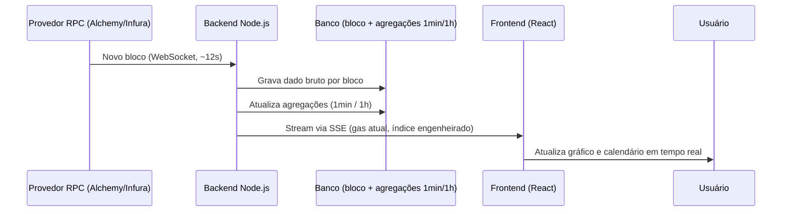
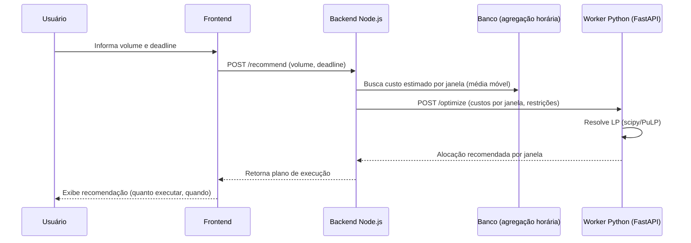
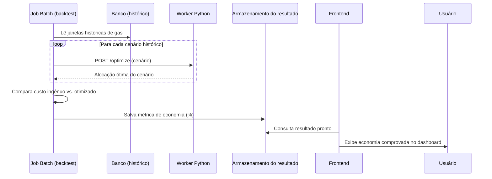

# Arquitetura Técnica — Monitor de Fees + Otimizador de Execução

## 1. Quem é o usuário

Gestor de fundo cripto / mesa institucional que executa operações on-chain de **alto volume** na Ethereum. Ele não quer conteúdo educacional ou analítico profundo — ele quer **previsibilidade operacional no momento da decisão**: "a taxa está subindo, executo agora ou espero?". Isso significa que a interface precisa priorizar **clareza e velocidade de leitura** acima de profundidade analítica, e que o backend precisa entregar dado com latência baixa o suficiente pra sustentar decisão em tempo real (daí o requisito de SSE em vez de polling).

## 2. Visão geral

O sistema tem três fluxos independentes, cada um com seu próprio ritmo:

1. **Ingestão e visualização em tempo real** — contínuo, baseado em eventos de bloco
2. **Recomendação do otimizador** — sob demanda, quando o usuário pede uma sugestão de execução
3. **Backtest histórico** — processo offline, roda em batch, não em tempo real

Cada um tem seu diagrama de sequência na seção 8.

## 3. Stack tecnológica

- **Frontend:** React + Vite + TypeScript
- **Backend principal:** Node.js + TypeScript
- **Solver de otimização:** Python + FastAPI (serviço separado)
- **Conexão blockchain:** WebSockets via provedor RPC (Alchemy/Infura), usando `viem` ou `ethers.js`
- **Entrega ao frontend:** SSE (Server-Sent Events)
- **Orquestração:** Docker + docker-compose (um serviço Node, um serviço Python)

## 4. Camadas de dados (granularidade)

Duas granularidades diferentes, para propósitos diferentes:

- **Captura (dado bruto):** nível de **bloco** (~12s por bloco na Ethereum). É o único jeito de de fato capturar a volatilidade instantânea da mempool — amostrar em intervalos maiores perde justamente o que estamos tentando resolver.
- **Agregação:**
  - **1 minuto** — camada intermediária (média/mediana/min/max dentro da janela)
  - **1 hora** — usada pela visão de calendário e pelo otimizador (decisões de execução acontecem em janelas de minutos/horas, não segundos)

Na prática: uma tabela granular por bloco + uma tabela (ou view materializada) já agregada por hora, pra evitar que o otimizador e as queries de estatística varram o dado bruto inteiro toda vez.

## 5. Visualização

Duas bibliotecas, cada uma cobrindo uma necessidade:

- **[lightweight-charts](https://github.com/tradingview/lightweight-charts)** (TradingView, open source) — para o gráfico contínuo em tempo real. Renderização em canvas, construída especificamente para séries temporais financeiras com streaming ao vivo, atualização eficiente sem re-renderizar tudo a cada tick.
- **[Apache ECharts](https://echarts.apache.org/)** — para a visão de calendário semanal (heatmap por hora) e gráficos agregados/estatísticos. Tem suporte nativo a calendar heatmap, o que a lightweight-charts não cobre.

## 6. Índice engenheirado de gas

Análogo ao CVDD (Cumulative Value-Days Destroyed) usado pela Alphractal para Bitcoin — uma fórmula de engenharia com fator de ajuste que converte o dado bruto de gas numa métrica única de "saúde"/custo real da rede, **não** um modelo estatístico preditivo. A fórmula em si ainda não está fechada — é matemática nova que precisa ser proposta e validada por vocês dois, usando como inspiração conceitual o CDD→CVDD e o Difficulty per Issuance.

## 7. Otimizador de execução (LP / Simplex)

**O que resolve:** dado um volume a executar até um deadline, recomenda como distribuir a execução ao longo do tempo pra minimizar custo total de gas.

**Formulação:**
- **Variáveis de decisão:** quanto volume executar em cada janela de tempo (janelas de 1h)
- **Função objetivo:** minimizar custo total = Σ (volume alocado na janela × custo estimado da janela)
- **Restrições:** soma do volume alocado = volume total a executar; possivelmente um teto de volume por janela

**Decisões já tomadas:**
- **LP contínuo é suficiente** — a alocação por janela é naturalmente uma fração contínua do volume, não há motivo de negócio pra forçar valores inteiros. Isso significa **não** precisamos de Branch and Bound / programação inteira, o que mantém o problema simples e rápido de resolver.
- Usar biblioteca pronta (`scipy.optimize.linprog`, PuLP, ou OR-Tools) em vez de implementar o simplex do zero — o esforço de vocês deve ir pra formular certo o problema, não pra reinventar o solver.
- O custo estimado por janela **não** exige modelo preditivo pesado — uma média móvel por hora do dia / dia da semana, calculada em cima da agregação horária (seção 4), já é suficiente como entrada pro LP.

**Onde roda:** serviço Python separado (FastAPI), endpoint `POST /optimize`, containerizado (Docker), chamado via HTTP síncrono pelo backend Node — o LP resolve em milissegundos, então não há necessidade de fila assíncrona.

## 8. Backtest histórico

Roda como **script/job batch offline**, não como chamada de API síncrona (diferente do endpoint de recomendação ao vivo). Compara, sobre uma janela de dados históricos, o custo de uma execução "ingênua" (tudo de uma vez, ou aleatória) contra o custo seguindo a recomendação do otimizador para o mesmo cenário — e salva o resultado (JSON ou registro em banco) pra o dashboard simplesmente ler, sem recalcular nada em tempo real.

---

## 9. Diagramas de sequência

### 9.1 Ingestão e visualização em tempo real

### 9.2 Recomendação do otimizador (sob demanda)

### 9.3 Backtest histórico (processo offline)

## 10. Serviços (docker-compose)

- `backend-node` — API principal, ingestão via WebSocket, exposição via SSE, orquestra chamadas ao solver
- `solver-python` — FastAPI, endpoint `/optimize`, roda o LP
- `db` — armazenamento (bruto por bloco + agregações)
- `frontend` — React app (pode rodar fora do compose em dev, servido separadamente em produção)

O job de backtest pode rodar dentro do próprio container `solver-python` como um script invocado manualmente/agendado, sem precisar de um serviço dedicado.
