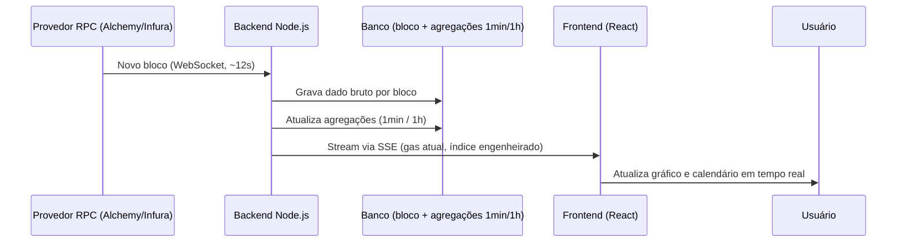
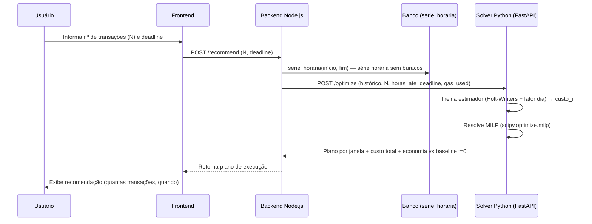
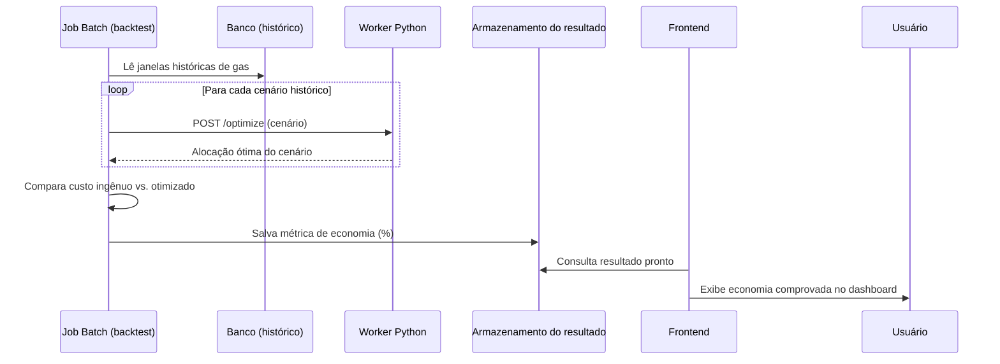

# Arquitetura Técnica — Monitor de Fees + Otimizador de Execução

## 1. Quem é o usuário

Gestor de fundo cripto / mesa institucional que executa operações on-chain de **alto volume** na Ethereum. Ele não quer conteúdo educacional ou analítico profundo — ele quer **previsibilidade operacional no momento da decisão**: "a taxa está subindo, executo agora ou espero?". Isso significa que a interface precisa priorizar **clareza e velocidade de leitura** acima de profundidade analítica, e que o backend precisa entregar dado com latência baixa o suficiente pra sustentar decisão em tempo real (daí o requisito de SSE em vez de polling).

## 2. Visão geral

O sistema tem três fluxos independentes, cada um com seu próprio ritmo:

1. **Ingestão e visualização em tempo real** — contínuo, baseado em eventos de bloco
2. **Recomendação do otimizador** — sob demanda, quando o usuário pede uma sugestão de execução
3. **Backtest histórico** — processo offline, roda em batch, não em tempo real

Cada um tem seu diagrama de sequência na seção 8.

## 3. Stack tecnológica

- **Frontend:** React + Vite + TypeScript
- **Backend principal:** Node.js + TypeScript
- **Solver de otimização:** Python + FastAPI (serviço separado)
- **Conexão blockchain:** WebSockets via provedor RPC (Alchemy/Infura), usando `viem` ou `ethers.js`
- **Entrega ao frontend:** SSE (Server-Sent Events)
- **Orquestração:** Docker + docker-compose (um serviço Node, um serviço Python)

## 4. Camadas de dados (granularidade)

Duas granularidades diferentes, para propósitos diferentes:

- **Captura (dado bruto):** nível de **bloco** (~12s por bloco na Ethereum). É o único jeito de de fato capturar a volatilidade instantânea da mempool — amostrar em intervalos maiores perde justamente o que estamos tentando resolver.
- **Agregação:**
  - **1 minuto** — camada intermediária (média/mediana/min/max dentro da janela)
  - **1 hora** — usada pela visão de calendário e pelo otimizador (decisões de execução acontecem em janelas de minutos/horas, não segundos)

Na prática (implementado em `db/init/01_schema.sql`):

| Objeto | O que é | Para quê |
|---|---|---|
| `bloco_gas` | hypertable, um registro por bloco | captura bruta; `preco_efetivo_wei` é coluna gerada (`base_fee + priority_fee_p50`) |
| `gas_1min` | continuous aggregate | camada intermediária (média/mediana/mín/máx) |
| `gas_1h` | continuous aggregate | calendário e estatísticas horárias |
| `serie_horaria(início, fim)` | função | série horária **sem buracos** (via `time_bucket_gapfill` + `interpolate`) para alimentar o estimador |

As duas agregações saem direto da hypertable, e não em cascata (1h sobre 1min): mediana não é composável — a mediana de 60 medianas de 1min não é a mediana da hora. Média, mediana, mín e máx ficam materializados; **moda** é calculada em query (`mode()` sobre um dia é barato e não justifica materialização).

`serie_horaria()` existe porque a decisão 8 exige série contígua: o Holt-Winters sazonal quebra se faltar hora, e queda de rede ou reorg produzem buraco. O preenchimento acontece **na leitura** — nunca se grava linha sintética no banco.

## 5. Visualização

Duas bibliotecas, cada uma cobrindo uma necessidade:

- **[lightweight-charts](https://github.com/tradingview/lightweight-charts)** (TradingView, open source) — para o gráfico contínuo em tempo real. Renderização em canvas, construída especificamente para séries temporais financeiras com streaming ao vivo, atualização eficiente sem re-renderizar tudo a cada tick.
- **[Apache ECharts](https://echarts.apache.org/)** — para a visão de calendário semanal (heatmap por hora) e gráficos agregados/estatísticos. Tem suporte nativo a calendar heatmap, o que a lightweight-charts não cobre.

## 6. Índice engenheirado de gas

Análogo ao CVDD (Cumulative Value-Days Destroyed) usado pela Alphractal para Bitcoin — uma fórmula de engenharia com fator de ajuste que converte o dado bruto de gas numa métrica única de "saúde"/custo real da rede, **não** um modelo estatístico preditivo. A fórmula em si ainda não está fechada — é matemática nova que precisa ser proposta e validada por vocês dois, usando como inspiração conceitual o CDD→CVDD e o Difficulty per Issuance.

## 7. Otimizador de execução (MILP)

**O que resolve:** dado um número de transações a executar até um deadline, recomenda como distribuir a execução ao longo do tempo pra minimizar custo total de gas.

**Formulação (fechada e testada — ver decisões 3, 6, 7, 9 do registro):**
- **Variáveis de decisão:** `x_i` = número **inteiro** de transações na janela `i` (janelas de 1h)
- **Função objetivo:** minimizar `Σ x_i × GAS_USED × custo_i`
- **Restrições:** `Σ x_i = N`; `0 ≤ x_i ≤ teto`, com `teto = max(⌈0,3×N⌉, ⌈N/M⌉)`

**Decisões já tomadas:**
- **MILP, não LP contínuo** — gas é custo fixo por transação (~21.000 para transferência, ~150.000 para swap), independente do valor movimentado. A variável é contagem de transações, que é inteira por natureza (decisão 3 — revisa a suposição original de LP contínuo).
- `scipy.optimize.milp` (backend HiGHS), **não** `linprog`, PuLP ou OR-Tools — mantém tudo no ecossistema scipy e resolve em milissegundos com 24 janelas (decisão 9).
- **Sem** restrição de mínimo por janela ou início forçado — testado via Monte Carlo e **descartado** por piorar mediana e pior caso (decisão 7). Não reintroduzir sem dado novo.
- O custo por janela vem de **Holt-Winters sazonal + fator de dia da semana** (decisão 8), não de uma média móvel simples — a média móvel foi testada e perdeu.
- **Horizonte parcial é truncado para baixo:** deadline de 5h30 vira 5 janelas de 1h. Conservador de propósito — nunca recomendar execução após o prazo real.

**Onde roda:** serviço Python separado (FastAPI), endpoint `POST /optimize`, containerizado (Docker), chamado via HTTP síncrono pelo backend Node — resolve em milissegundos, então não há necessidade de fila assíncrona.

**O endpoint faz estimativa E otimização.** O Node envia a série histórica horária (vinda de `serie_horaria()` no banco) junto com `N`, `horas_ate_deadline` e `gas_used`; o solver treina o estimador e resolve o MILP numa chamada só. Motivo: o estimador da decisão 8 usa `statsmodels`, que o backend Node não tem como executar. Módulos: `apps/solver/estimador_custo.py` e `apps/solver/otimizador.py`.

## 8. Backtest histórico

Roda como **script/job batch offline**, não como chamada de API síncrona (diferente do endpoint de recomendação ao vivo). Compara, sobre uma janela de dados históricos, o custo de uma execução "ingênua" (tudo de uma vez, ou aleatória) contra o custo seguindo a recomendação do otimizador para o mesmo cenário — e salva o resultado (JSON ou registro em banco) pra o dashboard simplesmente ler, sem recalcular nada em tempo real.

---

## 9. Diagramas de sequência

### 9.1 Ingestão e visualização em tempo real

### 9.2 Recomendação do otimizador (sob demanda)

### 9.3 Backtest histórico (processo offline)

## 10. Serviços (docker-compose)

- `backend-node` — API principal, ingestão via WebSocket, exposição via SSE, orquestra chamadas ao solver
- `solver-python` — FastAPI, endpoint `/optimize`, estima `custo_i` e roda o MILP
- `db` — TimescaleDB (Postgres + extensão de séries temporais); schema em `db/init/01_schema.sql`
- `frontend` — React app (pode rodar fora do compose em dev, servido separadamente em produção)

O job de backtest pode rodar dentro do próprio container `solver-python` como um script invocado manualmente/agendado, sem precisar de um serviço dedicado.
